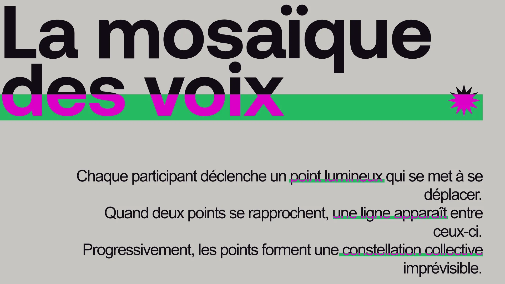

# La mosaïque du projet

<!-- Bannderole / Bande-annonce -->

## Description

<!-- Présentation de ce qu'est ce site et résumé du projet en un paragraphe, toujours à jour-->

La mosaïque des voix est une oeuvre interactive qui relie l’humain et la collectivité à travers la lumière et le mouvement. Chaque participant déclenche un point lumineux qui se met à se déplacer librement dans l’espace. Lorsque deux points se rapprochent, une ligne apparaît entre eux, comme deux étoiles qui se rejoignent. Progressivement, les points s’unissent pour former une constellation collective, unique et imprévisible. L'oeuvre illustre la façon dont une communauté se tisse à partir de connexions invisibles et éphémères. En participant, chacun devient une lumière parmi d’autres, contribuant à la construction d’un ensemble vivant, fragile et poétique.
