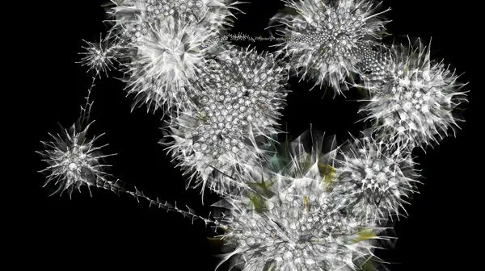
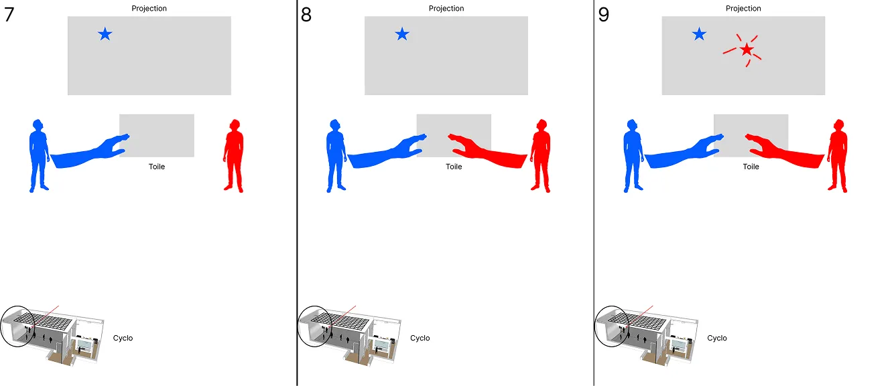

# Concept

## Le pitch initial

<!-- Inclure la vidéo du PowerPoint intial -->

<!-- Méthode 1 -->
<iframe width="560" height="315"
  src="https://www.youtube.com/embed/-4Wobe5UB5M"
  title="YouTube video"
  frameborder="0"
  allowfullscreen>
</iframe>  
    
La mosaïque des voix est une installation interactive où chaque main posée sur une toile déclenche un point lumineux qui se relie aux autres, formant une constellation en évolution. L’oeuvre révèle comment des gestes individuels tissent une communauté, où chacun devient une lumière parmi les autres.

<!-- Méthode 2, plug legit -->
<!-- 

-->

<!-- Méthode 3 (vidéo local) -->
<!-- 
 
-->

## L'expérience

### Le parcours de l'interacteur

L’interacteur découvre une toile et y pose sa main. Une étoile apparaît là où il touche, projettée sur une projection murale. En posant sa deuxième main, une autre étoile se crée et se relie à la première. Chaque nouvelle main qui entre en contact avec la toile, qu’elle soit de la même personne ou d’un autre participant, contribue à étendre le réseau d’étoiles, créant ainsi une constellation collective et vivante.

L’interacteur découvre une toile où il peut poser ses mains. Chaque main déposée crée une étoile projetée sur le mur. Lorsqu’une autre main (qu’elle appartienne à la même personne ou à quelqu’un d’autre) touche la toile, une nouvelle étoile apparaît et se relie aux précédentes. Plus plusieurs personnes interagissent simultanément avec la toile, plus le réseau d’étoiles s’étend et perdure dans le temps.

<!-- 
Comportement de l’interacteur
Qu'est-ce que fait l'interacteur?
un résumé du parcours de l'interacteur du début à la fin de son expérience - qu'est-ce qu'il fait, qu'est-ce qu'il manipule, etc
-->

### L'espace

L’espace réel est une salle obscure avec une projection murale. Cette projection devient un espace virtuel en affichant un ciel vivant en temps réel. Les participants partagent une même expérience, à la fois physique et numérique, créant un univers commun où le réel et le virtuel se rejoignent et se prolongent mutuellement. La salle devient un lieu commun où les participants se rassemblent, se rapprochent et interagissent dans un même espace physique. Le virtuel amplifie leurs gestes : ce qu’ils font ensemble dans la pièce se transforme en une constellation vivante, reliant leurs présences à travers un même environnement partagé. Le résultat de leurs actions sur la toile se traduit sur la projection murale.

<!-- 
description de l'espace réel et virtuel du projet et comment l'espace réel est transposé, transorté ou prolongé dans le virtuel et inversement 
-->

### La progression

La progression dépend du collectif. Chaque nouvelle personne qui intéragit avec la toile prolonge la durée de vie de la constellation, tandis que l’absence la fait disparaître. Le temps devient ainsi le reflet de l’activité humaine. La progression n’est pas imposée, mais important pour la vie de l'oeuvre. La progression naît de la participation et s’éteint avec elle. L’oeuvre évoque une perception à la fois subjective et collective du temps, où chaque geste compte pour maintenir l’existence du tout.

### L'aspect collectif

<!-- 
comment votre idée de projet correspond au thème du COLLECTIF 
Plus il y a de personnes qui peuvent interagir simultanément est un critère important ! 

Un collectif désigne l'ensemble de personnes ou d'entités qui s'unissent de manière concertée pour poursuivre un objectif commun, en coopérant et en collaborant pour atteindre des buts qui seraient difficiles à réaliser individuellement.
 Il peut s'agir d'une réunion informelle ou contractuelle, temporaire ou durable, constituée autour d'une cause, d'une action ou d'un projet, qu'il soit artistique, politique, professionnel, moral ou cultuel.
 Ce groupe, souvent considéré comme une entité à vocation communautaire, fonctionne sous le pilotage de ses membres et repose sur une volonté partagée de développer des solidarités.
-->
L'expérience repose entièrement sur la participation collective. Chaque personne qui interagit avec ses mains ajoute une étoile au système, contribuant ainsi à l’expansion de la constellation. Plus il y a de participants, plus la constellation s'agrandit. Plus la constellation est grande, plus elle se prolonge dans le temps. Le collectif devient ici le moteur même de l’expérience : sans les autres, la constellation ne peut ni grandir ni perdurer. L’oeuvre met en valeur la force du « nous », une création née de la cohabitation des autres personnes dans l'espace commun. L'oeuvre repose sur la participation de plusieurs mains : chaque main posée sur la toile crée une étoile. Lorsque plusieurs personnes touchent la toile en même temps, leurs étoiles se relient et forment une constellation collective. Plus il y a de participants, plus la constellation grandit. L’oeuvre existe donc grâce au groupe : c’est la présence des autres qui permet réellement de créer la forme finale. Une seule personne peut créer quelques étoiles, mais c’est seulement lorsqu’un groupe interagit simultanément que la constellation se développe en une structure riche et complexe. Chaque main ajoute un point, mais ce sont les autres mains qui donnent une forme au réseau en créant de nouveaux liens. Le collectif n’est pas seulement un ensemble de participants : c’est la coopération immédiate entre plusieurs personnes qui rend possible l’émergence de la constellation. L’œuvre démontre que certaines formes n’existent que grâce à l’action coordonnée et partagée d’un groupe.

### L'aspect social

<!-- 
comment votre idée de projet correspond au thème du SOCIAL 

Le terme « social » désigne ce qui concerne la vie en société, c’est-à-dire les relations entre les individus au sein d’un groupe organisé, ainsi que les structures, normes et institutions qui en découlent.
 Il peut s’appliquer à des aspects variés, comme la vie sociale, les groupes sociaux, les classes sociales, les rapports de production, ou encore les politiques visant à améliorer les conditions de vie des individus.
 En sciences sociales, le social englobe l’étude des phénomènes collectifs, des interactions humaines, des normes sociales et des dynamiques de pouvoir au sein de la société.
 L’adjectif peut aussi qualifier des animaux ou des plantes vivant en communauté selon des règles strictes, comme les insectes sociaux (fourmis, abeilles) ou certaines espèces végétales formant des colonies denses.
-->
L’aspect social est représenté par le lien symbolique entre les participants. "Nous" créons un espace où chaque geste individuel prend sens à travers les autres. Ensemble, les participants bâtissent une constellation commune, visible uniquement par la coopération. L'oeuvre illustre coment nos actions isolées peuvent s’unir pour former une structure collective plus grande que nous-mêmes. En se connectant par les étoiles, chacun devient conscient de son rôle dans un réseau plus vaste. L’oeuvre représente la manière dont nos interactions, même petites, tissent des relations invisibles qui renforcent le sentiment d’appartenance à une communauté. L'oeuvre illustre à la fois la beauté et la fragilité des liens humains. La constellation sert à représenter visuellement les liens sociaux entre les participants. Chaque étoile symbolise une main individuelle, mais c’est seulement en se reliant aux autres qu’elle prend sens. La forme de la constellation montre que nos gestes isolés deviennent une création commune grâce aux autres. L'oeuvre envoie un message de "l'ensemble est construit uniquement par la coopération humaine". Chaque étoile représente une main individuelle, mais elle ne prend sens que lorsqu’elle se relie aux autres, comme les individus qui composent une société. Les liens lumineux matérialisent la manière dont les relations humaines construisent un tissu social : fragile, éphémère, mais essentiel. L’œuvre souligne aussi le caractère social du temps : si personne ne participe, les étoiles s’éteignent peu à peu, rappelant que les liens humains doivent être entretenus pour durer. La constellation devient ainsi une métaphore visuelle du vivre-ensemble : une structure commune, créée par plusieurs, toujours en formation et constamment dépendante des interactions humaines.
 
## Inspirations

### Inspirations visuelles et sonores

<!-- Inclure le moodboard avec référenes pour chacune des sources-->

Inspirations

Ambiance sonore
[Inspiration d'ambiance de fond lorsque peu d'étoiles présentes](ambiance1.mp3)
[Inspiration d'ambiance de fond/harmonie lorsque peu d'étoiles présentes](ambiance2.mp3)
[Inspiration d'ambiance de fond/harmomie lorsque peu d'étoiles présentes](ambiance3.mp3)
[Inspiration de son lorsque des étoiles tissent des liens](connexion.mp3)
[Inspiration de son lorsque une étoile apparait](etoiles.mp3)

<!--
Images inspirantes
Représentations visuelles de l'ambiance recherchée, que ce soit à travers des photographies, des illustrations, ou des œuvres existantes.

Palette de couleurs
Choix de couleurs qui influenceront l’éclairage, les médias projetés, ou l’interface visuelle.

Références multimédia
Vidéos, musiques ou sons, séquences animées qui capturent l’énergie ou la tonalité souhaitée pour l'installation.

Textures et matériaux
Échantillons ou représentations de matériaux tangibles qui seront utilisés dans l'installation (écrans, surfaces tactiles, objets physiques interactifs).

Ambiance sonore et lumineuse
Inspirations relatives à la scénarisation de la lumière et du son, qui seront des éléments interactifs clés dans l’expérience utilisateur.
-->

### Inspirations interactives

Rhizomatique nous a grandement inspiré au niveau de l'intéractivité et la logique de celle-ci. Notre projet reprend le concept d'appuyer sur une toile afin de créer un résultat. Appuyer sur une toile comme façon d'intéraction avec l'expérience dans le but de recevoir des données dans l'ordinateur était original, chose qui nous a grandement inspiré.

NodeBeat nous a inspiré au niveau de l'esthétisme et de la ressemblance. Notre projet reprend le concept d'avoir des lignes entre des points.

## Scénarimage

<!-- Pour chaque étape/scène : une image avec du texte descriptif et une explication de la transition -->

<!--
Éléments du scénarimage
Séquence visuelle
Chaque scène ou séquence du scénarimage doit être clairement illustrée, montrant les éléments visuels qui seront projetés ou affichés. Cette séquence visuelle peut inclure des captures d'écran, des croquis ou des rendus 3D, en fonction des besoins du projet.

Points d'interaction
Le scénarimage dans un cadre interactif inclut les moments où l'utilisateur interagit avec l'installation. Ces points d’interaction doivent être représentés graphiquement pour indiquer comment et quand l’utilisateur influencera la progression du récit ou des effets visuels et sonores.

Évolution du récit
Comme pour le scénario narratif, le scénarimage doit montrer la progression de l’histoire ou de l’expérience au fil des interactions. Il permet de visualiser comment l’installation évolue en fonction des actions de l'utilisateur, avec des embranchements possibles selon ses choix.

Retour visuel et sensoriel
Le scénarimage doit inclure des annotations ou des visuels montrant les réponses visuelles, sonores ou tactiles à chaque interaction. Cela peut inclure des changements d’éclairage, des transitions vidéo, ou des effets sonores qui réagissent aux actions de l’utilisateur.
-->
