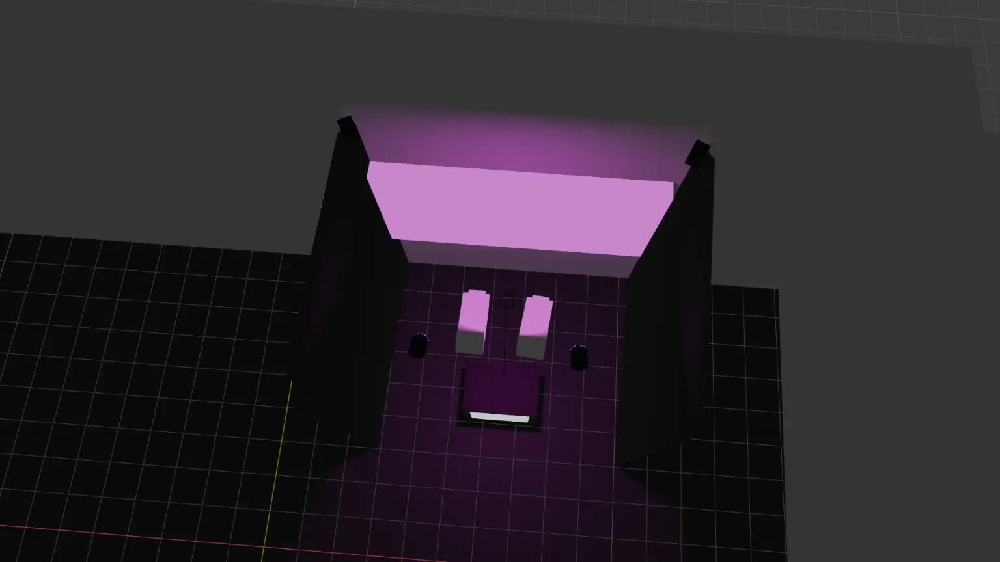
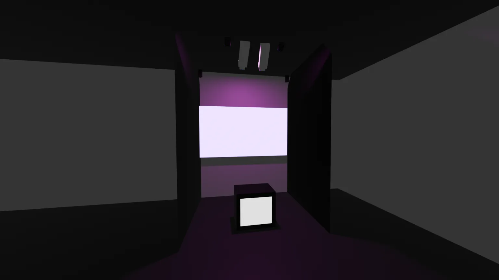
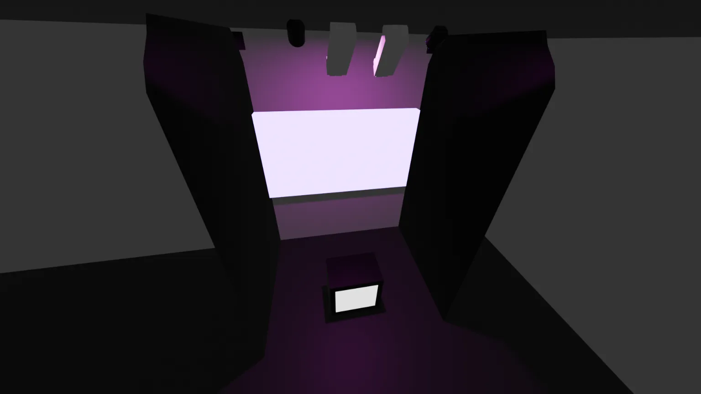

# Maquette (faisabilité)

<!--
https://tim-montmorency.com/582523-gestion/#/contenus/3_planification/

# Maquette

## Importance de la maquette dans les projets multimédias
Une maquette permet de déterminer si un projet est réalisable sur les plans technique, économique et opérationnel. Elle aide à identifier les obstacles potentiels et à planifier les ressources nécessaires. Dans le contexte des technologies interactives, où les innovations sont rapides et les attentes des utilisateur·rice·s élevées, cette démarche devient encore plus critique.

## Étapes clés de la maquette

### 1. Ascpect technique
- **Analyse des exigences techniques** : Définir les spécifications techniques du projet, y compris les logiciels, le matériel, les interfaces utilisateur et les protocoles de communication.  
- **Compatibilité du système** : Vérifier si les nouvelles technologies interactives sont compatibles avec les systèmes existants.  
- **Tests** : Effectuer des tests pour valider les fonctionnalités et l'interactivité.  

### 2. Ascpect économique
- **Estimation des coûts** : Calculer les coûts associés à l'acquisition de matériel, de logiciels, au développement et à la maintenance.  
- **Analyse du retour sur investissement (ROI)** : Évaluer les bénéfices potentiels par rapport aux coûts engagés.  
- **Options de financement** : Explorer les subventions, les partenariats ou les modèles économiques alternatifs.  

### 3. LES RÈGLES ET LE SYSTÈME 

```mermaid
graph LR
    Règles Système
    Système Expérience
```

1. **Les règles sont les briques de base.**  
2. **Le système applique les règles.**  
3. **L’expérience est la perspective du joueur.**  

### 4. Asect temporelle
- **Planification du projet** : Établir un calendrier réaliste en tenant compte des délais de développement, de test et de déploiement.  
- **Gestion des risques** : Identifier les risques potentiels qui pourraient retarder le projet et prévoir des plans d'urgence.  

### 5. Aspect légal et éthique
- **Conformité réglementaire** : S'assurer que le projet respecte les lois en vigueur, notamment en matière de propriété intellectuelle et de protection des données.  
- **Accessibilité** : Garantir que l'installation interactive est accessible à tous les utilisateur·rice·s, y compris les personnes en situation de handicap.  

-->

## Scénarisation de l'interactivité
 
#### Scène 1
| Verbe action | Condition de déclenchement | Effet visuel | Effet sonore | Effet interactif |
| ------- | ------- | ------- | ------- | ------- |
| **Toucher**              | Une main entre en contact avec la toile | Une étoile apparaît à l’endroit précis du toucher et émet une lueur | Note douce courte se déclenche à chaque contact | La main est détectée comme unité active, enregistrant sa position dans l’espace de la toile  |
| **Maintenir** | La main reste immobile sur la surface | L’étoile devient plus brillante | La note s’allonge, devient vibrante | Le système stabilise la position et augmente l’intensité lumineuse selon la durée du contact |
| **Relâcher** | La main se retire de la surface | L’étoile reste visible mais cesse de pulser (disaparait au bout de 1 min si aucun toucher; scène 3) | Le son s’éteint progressivement | Passage à la scène 2 si une autre main entre en interaction |

#### Scène 2
 
| Verbe action | Condition de déclenchement | Effet visuel | Effet sonore | Effet interactif |
| ------- | ------- | ------- | ------- | ------- |
| **Toucher simultané** | Trois ou plusieurs mains sont détectées en même temps | Les étoiles se relient entre elles par des filaments lumineux | Des harmonies s’ajoutent | Le système relie les points de contact pour former une structure de constellation |
| **Déplacer**  | Une main glisse légèrement sur la toile | Le filament entre les étoiles se déforme en suivant le mouvement | Le son ondule avec la trajectoire du mouvement | Le réseau devient fluide et réactif, suivant la dynamique des mains |
| **Toucher**  | Une nouvelle main touche la toile | Une nouvelle étoile s’ajoute à la constellation existante | Une nouvelle couche sonore s’intègre | La constellation grandit et devient plus complexe |
| **Retirer** | Une ou plusieurs mains se retirent | Les liens se brisent doucement et les étoiles concernées s’éteignent lentement | La couche sonore correspondante s’éteint | Si toutes les mains disparaissent, passage à la scène 3 |

 
#### Scène 3
 
| Verbe action | Condition de déclenchement | Effet visuel | Effet sonore | Effet interactif |
| ------- | ------- | ------- | ------- | ------- |
| **Inactivité** | Aucune main n’interagit avec la toile pendant 1 minute | Les étoiles s’éteignent graduellement jusqu’à disparaître dans le noir | Le son devient léger, couche par couche le son faiblit | Le système “oublie” lentement la constellation, retour à l’état initial (néant) |
| **Toucher** | Une main touche de nouveau la toile après extinction | Une première étoile apparait au point de contact| Une note pure relance la séquence sonore | Retour à la scène 1, cycle relancé |


## Équipements requis
#### Audio
- 2 haut-parleurs actifs de 4"
- 2 fils XLR 3 conducteurs de 15'
- Carte de son + adapteur powerCON
 
#### Vidéo
- 2 projecteurs Epson PowerLite 990U
- 2 kinects
- 3 cables HDMI
 
#### Lumière
- 2 lumières LED RGBAW DMX
- 2 fils XLR 3 conducteurs de 20'
- 1 Interface DMX Via XLR

#### Électricité
- 2 extensions
 
#### Réseau
- 3 cables ethernet
- 2 transmetteurs et 2 récepteurs (pour projection)
#### Ordinateurs
- 1 ordinateur portable (avec cable d'alimentation)

## Logiciels Requis
#### Environnement de programmation
- Touch Designer (Logique, ensemble du projet)
#### Design graphique/Effets visuels
- After Effects (Éléments pré-prod au besoin)
- Photoshop (Éléments pré-prod au besoin)
#### Gestion de l'éclairage
- QLC+ (Éclairage)
#### Audio
- FL Studio (Composition sonore)
- Synthétiseurs VST (WaveTable)

## Synoptique


## Plan d'implémentation





## Budget estimé

| Objet| Descritpion | Prix | URL/Provenance |
| ------ | ------ | ------ | ------ |
| Toile spandex | Toile en spandex qui sera l'élément principal de l'intéraction | 29$/0.9m | [Amazon](https://www.amazon.ca/Nylon-Spandex-Fabric-Yard-Activewear/dp/B0FKBBH6LN)|
| Bois traité | Pour construire le cadre de la toile | ~5$/planche | [Rona](https://www.rona.ca/fr/produit/1-po-x-6-po-x-8-pi-bois-traite-brun-b4f-761-62892-84895013) |
| Peinture | Peinture pour peinturer la structure qui servira de cadre à la toile | 35$/950ml | [HomeDepot](https://www.homedepot.ca/produit/rust-oleum-painter-s-touch-peinture-multi-usages-en-noir-mat-946-ml/1000155179) |
| Pinceau | Pour peinturer la structure | ~4$/pinceau   | [HomeDepot](https://www.homedepot.ca/produit/hdg-pinceau-a-peinture-a-copeaux-plats-de-2-pouces-50-8-mm-de-largeur-paquet-de-1-/1000738776) |
|  |  |  | |
| Total | ~150$ |